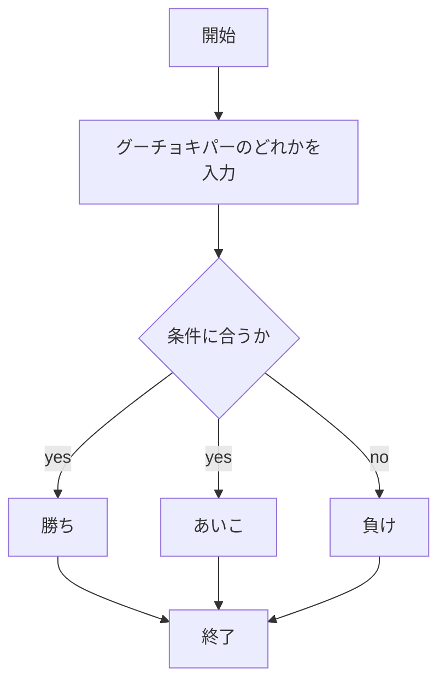
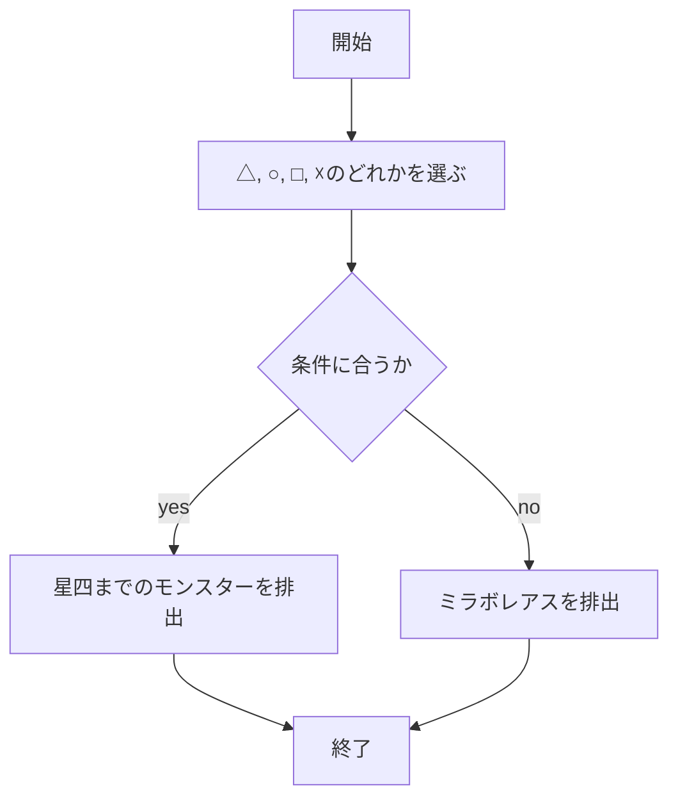
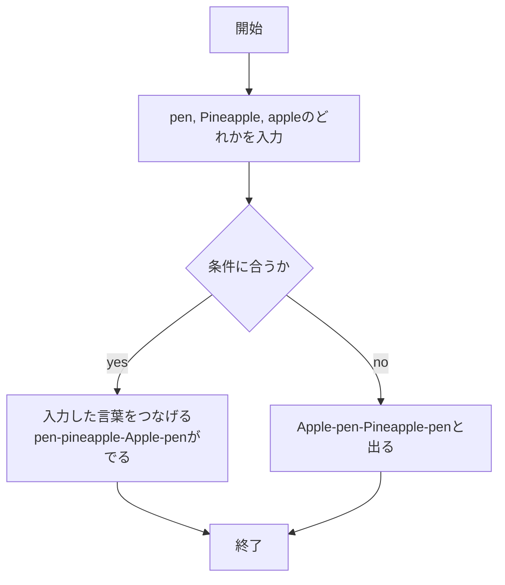
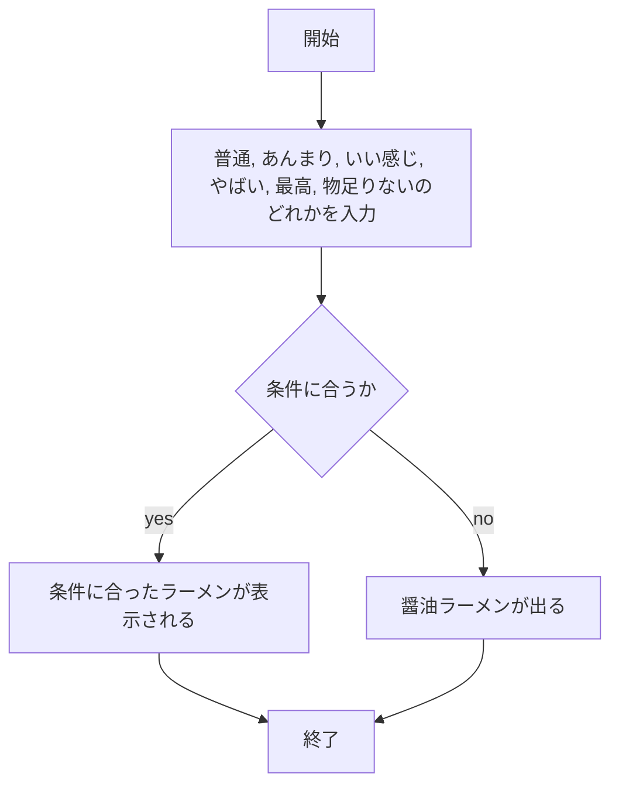

# report06

## １．じゃんけん機能について

### 実装手順

1. `app5.js` を起動する
1. Web ブラウザで `localhost:8080/public/janken.html` にアクセスする
1. 自分の手を入力する

### このプログラムについて



### ファイル一覧

| ファイル名         | 説明                             |
| ------------------ | -------------------------------- |
| app5.js            | プログラム本体                   |
| public/janken.html | じゃんけんの開始画面             |
| janken.ejs         | じゃんけんのテンプレートファイル |

10/29

## ２．ガチャガチャ機能について

### 実装手順

1. `app5.js` を起動する
1. Web ブラウザで `localhost:8080/public/ga.html` にアクセスする
1. 指定された文字を入力する

### このプログラムについて



### ファイル一覧

| ファイル名     | 説明                               |
| -------------- | ---------------------------------- |
| app5.js        | プログラム本体                     |
| public/ga.html | ガチャガチャの開始画面             |
| ga.ejs         | ガチャガチャのテンプレートファイル |

11/18

## 2．ppap 機能について

### 実装手順

1. `app5.js` を起動する
1. Web ブラウザで `localhost:8080/public/ppap.html` にアクセスする
1. 指定された文字を入力する

### このプログラムについて



### ファイル一覧

| ファイル名       | 説明                        |
| ---------------- | --------------------------- |
| app5.js          | プログラム本体              |
| public/ppap.html | ppap の開始画面             |
| ppap.ejs         | ppap のテンプレートファイル |

## 2． ラーメン機能について

1. `app5.js` を起動する
1. Web ブラウザで `localhost:8080/public/noo.html` にアクセスする
1. 自分の気分を入力する

### このプログラムについて



### ファイル一覧

| ファイル名      | 説明                       |
| --------------- | -------------------------- |
| app5.js         | プログラム本体             |
| public/noo.html | noo の開始画面             |
| noo.ejs         | noo のテンプレートファイル |

12/27 ##　フローチャー

```mermaid
flowchart TD;
sequenceDiagram
    ブラウザ->>サーバ: Webページを取得
    サーバ-->>ブラウザ: HTML, JS, CSS
    ブラウザ->>BBSクライアント: 起動
    BBSクライアント->>BBSサーバ: 投稿 (Post)
    BBSサーバ-->>BBSクライアント: 全書き込み数を返す
    BBSクライアント->>BBSサーバ: 読み込み (Read)
    BBSサーバ-->>BBSクライアント: 投稿データを送信
    BBSクライアント->>BBSサーバ: 新規チェック (Check)
    BBSサーバ-->>BBSクライアント: 全書き込み数を返す
    BBSクライアント->>BBSサーバ: 返信 (Post Reply)
    BBSサーバ-->>BBSクライアント: 返信データを保存
    BBSクライアント->>BBSサーバ: 返信の読み込み
    BBSサーバ-->>BBSクライアント: スレッド付き返信データを送信
```
