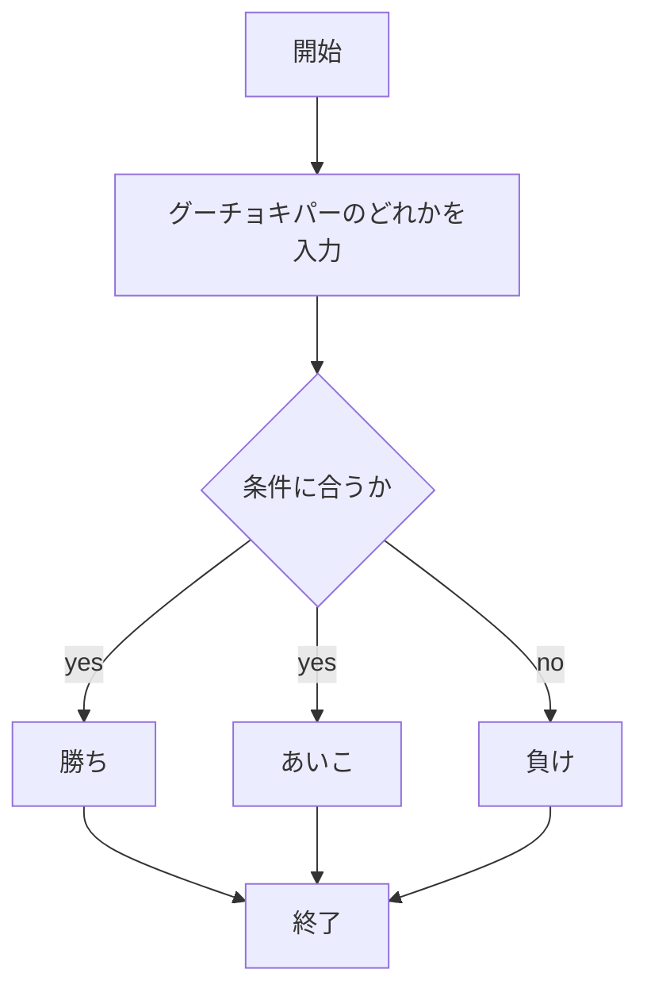
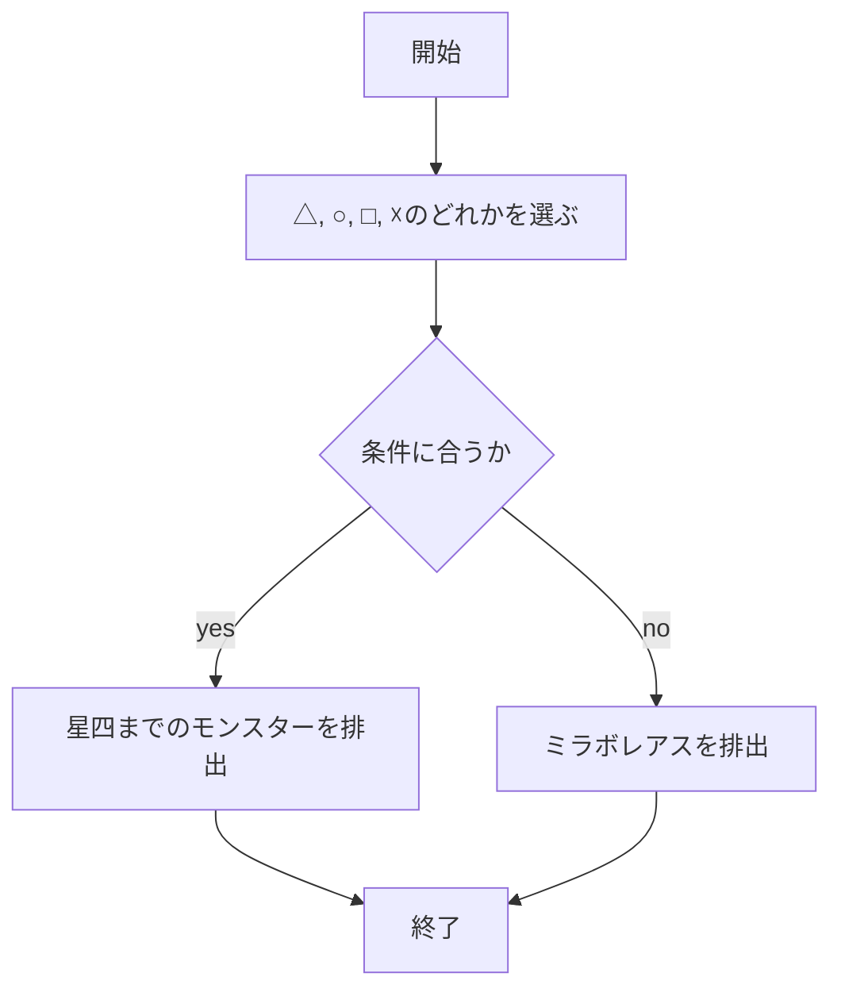
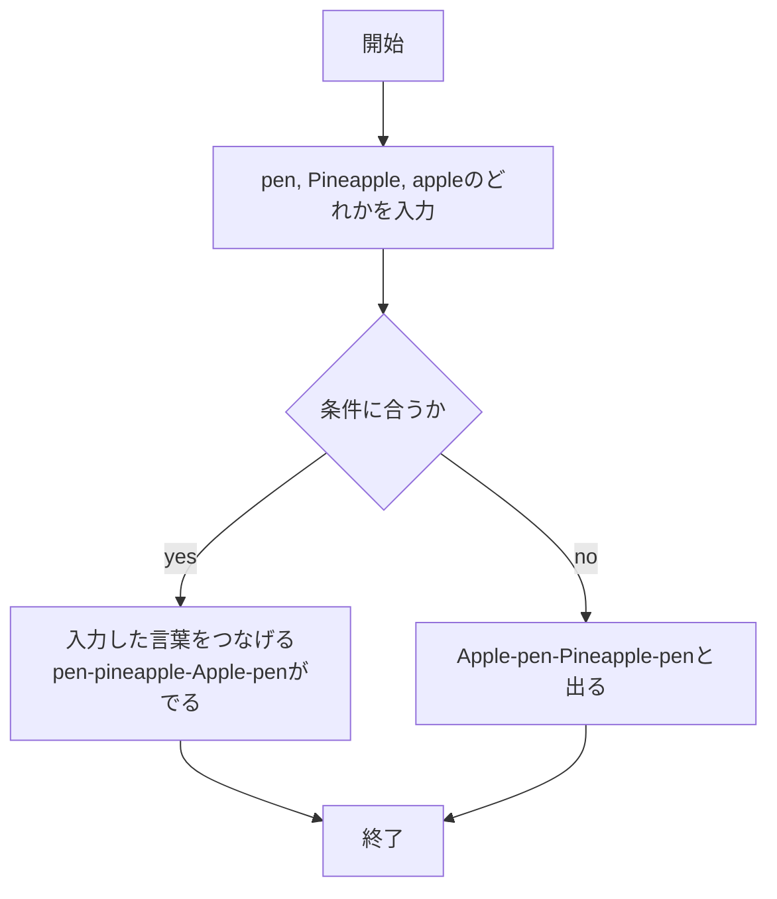

# report06

## １．じゃんけん機能について

### 実装手順

1. `app5.js` を起動する
1. Web ブラウザで `localhost:8080/public/janken.html` にアクセスする
1. 自分の手を入力する

### このプログラムについて

### ファイル一覧

| ファイル名         | 説明                             |
| ------------------ | -------------------------------- |
| app5.js            | プログラム本体                   |
| public/janken.html | じゃんけんの開始画面             |
| janken.ejs         | じゃんけんのテンプレートファイル |

10/29

## ２．ガチャガチャ機能について

### 実装手順

1. `app5.js` を起動する
1. Web ブラウザで `localhost:8080/public/ga.html` にアクセスする
1. 指定された文字を入力する

### このプログラムについて

### ファイル一覧

| ファイル名     | 説明                               |
| -------------- | ---------------------------------- |
| app5.js        | プログラム本体                     |
| public/ga.html | ガチャガチャの開始画面             |
| ga.ejs         | ガチャガチャのテンプレートファイル |

11/18

## 2．ppap 機能について

### 実装手順

1. `app5.js` を起動する
1. Web ブラウザで `localhost:8080/public/ppap.html` にアクセスする
1. 指定された文字を入力する

### このプログラムについて

### ファイル一覧

| ファイル名       | 説明                        |
| ---------------- | --------------------------- |
| app5.js          | プログラム本体              |
| public/ppap.html | ppap の開始画面             |
| ppap.ejs         | ppap のテンプレートファイル |

11/18
